# SLO Utility

## AWS Resource Details
The below table contains the details of the AWS resources involved in SLO module.
These resources needs to exported as CFT templates and migrated to the other environment(s).
| AWS Resources | Name of the Resources |
| ------------- | --------------------- |
| DynamoDB      | <ul><li>Application_Details</li><li>OktaDetails</li></ul> |
| Elastic Beanstalk | CustomLogoutApp |
| SecretsManager | OKTA_DEV_TOKEN  (The name can be changed as per the environment) |
| IAM Roles | <ul><li>access_secret_manager_role</li><li>aws-elasticbeanstalk-ec2-role</li><li>aws-elasticbeanstalk-service-role</li><li>AWSServiceRoleForAutoScaling</li><li>AWSServiceRoleForElasticLoadBalancing</li></ul> |

## OpenID setup in Okta
A “dummy” Single Page OpenID application has to be created in Okta.Set up an Open ID Application in by choosing the platform as “Single Page App”

By creating this application in Okta, we will use this application’s Client ID which is needed to determine userid of current user’s session.
Okta JS library provides the logic to do the sign in process and get the current user’s session and this needs a Client ID of an application configured in Okta..
Using current user’s session, we can determine userid from Okta for current user session and use i in further processing with SysLogs API to get all applications user has signed into.

### Detailed Steps to the above task

1. Log into Okta as an Administrator
2. Click on the Applications tab in the Okta Dashboard
  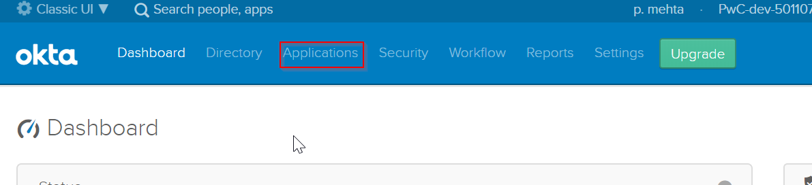
3. Click on Add Application. Select new application
  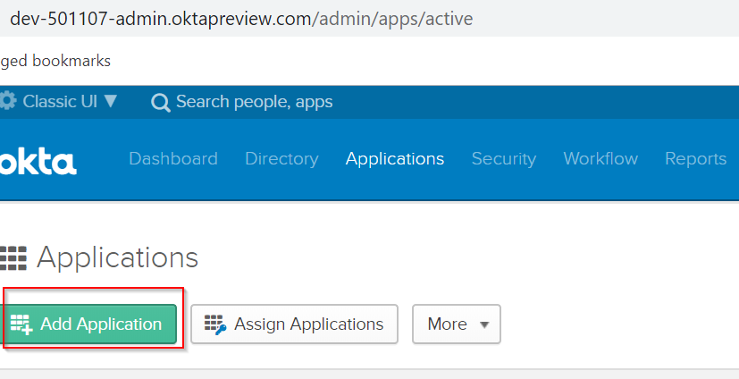
4. Select application type/platform as SPA (Single Page Application)
5. Select sign-on method as OIDC (OpenIDConnect)
6. All the above steps are in the screenshot attached below
   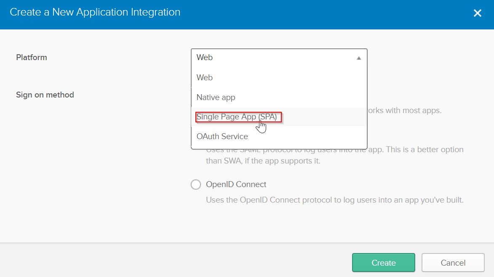
7. If you see in the General Settings section you can select Grant Types as shown in the below screenshot
8. Select Authorization Code/Implicit as Grant Type or both of them
9. Implicit has ID/Access Token as the options
  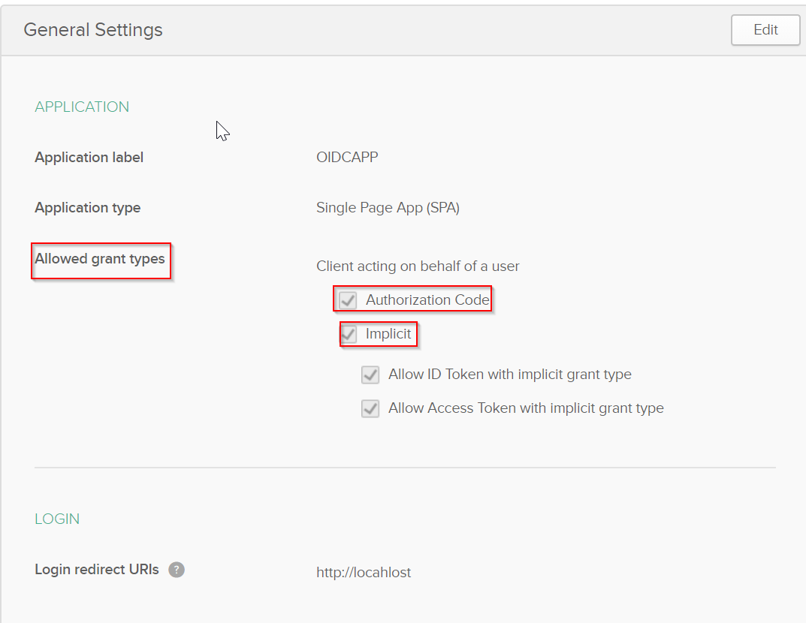
10. Follow the steps shown in the above screenshot
  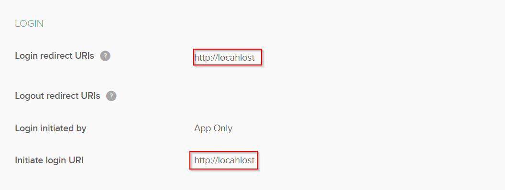
11. Follow same steps shown in the above screenshot
    
    Make a note of the “Client ID”
    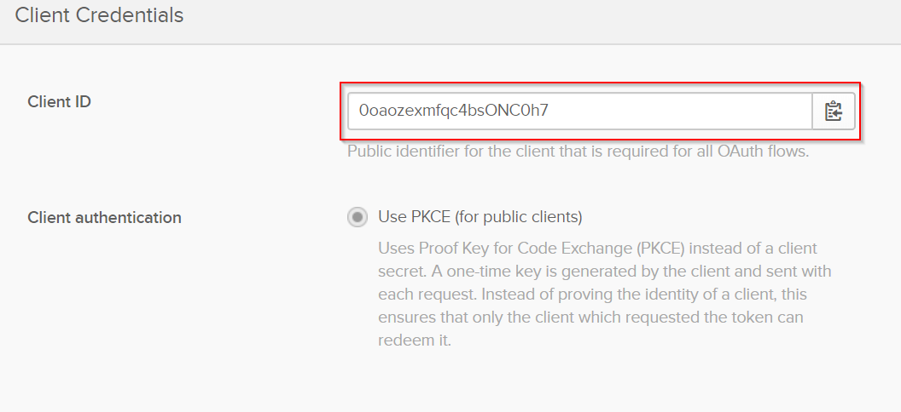
12. Note the Client ID as shown in the above screenshot. Select Use PKCE Option here

## Steps to Generate Admin Token from Okta

Using current user’s session for which we created the OpenId application in above section, we can determine user id from Okta for current logged in user.
For further processing with SysLogs API to get all applications user has signed into, we need to call Okta API as an administrator using Admin Token. This token will be stored in AWS Secrets Manager for this setup.

Follow the steps below to get an Admin Token from Okta
1. Log into Okta as an Administrator
2. Go to the Security tab
  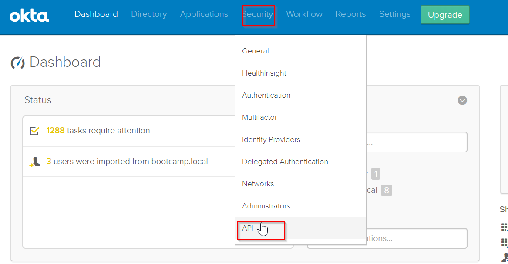
3. In API section select Tokens tab and click on Create Token
  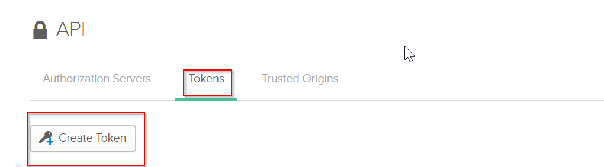
4. Create a Token by clicking the button
  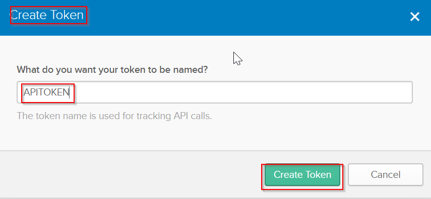
5. Token will be created once you follow the above steps

## SecretsManager setup in AWS - Store Admin token in AWS Secrets Manager

Create a new secret in the AWS Secrets Manager. This token stores the Okta Admin Token which will be used to invoke SystemLog API.

  * Login to AWS as an Administrator who has the permission to create a token in Secrets Manager
  * Click on “Services” → “Secrets Manager”
  * Click on “Store a new secret” button

 ### Detailed Steps to do the above task
1. Log into AWS Console as an Administrator.
2. Make sure you have the permission to create token in Secrets Manager.
3. Click on Services tab. Next, click on Secrets Manager.
4. Go to Secrets Manager and click on the button **“Store a new secret button”**
  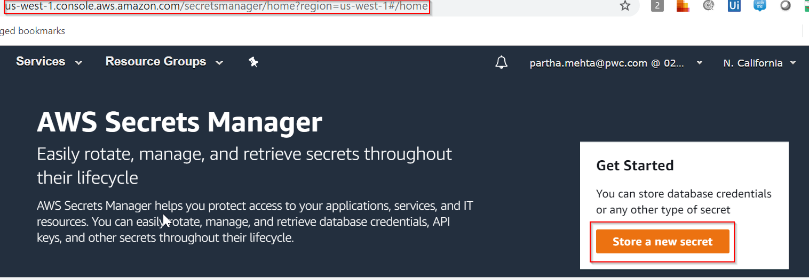
  Choose “Other type of secrets”
5. Select Other type of Secrets (API key)
  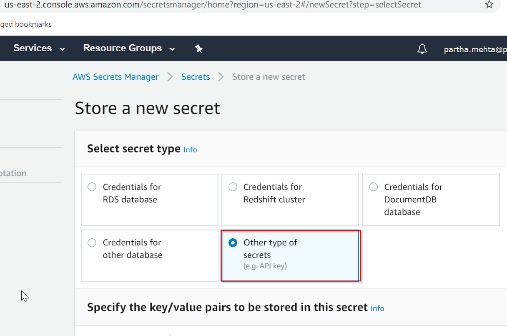
  Enter a “Secret Name” - for example -  OKTA_ADMIN_TOKEN and provide the value.
  
  **<ins>Make a note of the Secret Name</ins>**
  
  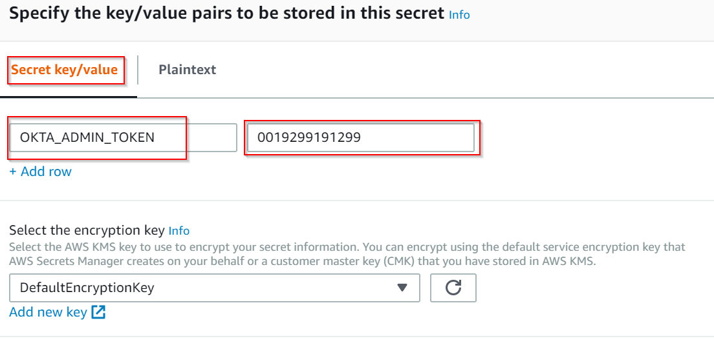
  
6. Provide the name for the secret and the value for the key. This is a key value pair
    - Click on “Next”
    - Provide the Secret name (same as above) and provide a description
      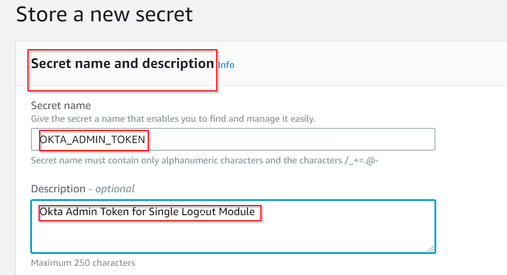
    - Keep the remaining configurations as default
    - Click on “Store”
    
7. Follow the steps as shown in the screenshots above

## DynamoDB setup in AWS

### Detailed steps to do the above task

1. Login to AWS Console as an Administrator.
2. Go to DynamoDB option.
3. Here, there is a table named OktaDetails.
4. Update the “OktaDetails” table based on the information provided in the table below.
5. Please make a note that few items depends on the environment and few are constant values

### Table 1: OktaDetails
Update the “OktaDetails” table based on the information provided in the below table.
Please make a note that few items depends on the environment and few are constant values

| Column Name | Description | Value |
| ----------- | ----------- | ----- |
| OKTA_BASE_URL | Base URL of the Okta tenant | https://{url} |
| OIDC_CLIENT_ID |  | 2892389392 |
| ISSUER | <OKTA_BASE_URL>/oauth2/default | https:// {url}/oauth2/default |
| Syslog_API_Hours |  | 24 |
| CIMA_LOGOUT_URL | Logout URL of CIMA Applications | http://login.xfinity.com/logout |
| OKTA_API | Okta’s System Log API | https:// {url}/api/v1/logs |
| eventType |  | user.authentication.sso |
| outcome.result| | SUCCESS |
| Okta_Environment|  | DEV |
| TOKEN_KEY | | |

1. Login to AWS Console as an Administrator.
2. Go to DynamoDB option.
3. Here, there is a table named Application_Details

### Table 2 : Application_Details

| Column Name | Description | Example |
| ----------- | ----------- | ------- |
| Application_Name | Name of the application (Make sure the application name matches with the name in Okta) | Fortinet Inline Hook Test |
| Application_Logout_URL | Logout URL of the application | https://samltest.id/Shibboleth.sso/Logout |

## EBS setup in AWS

Deploy the application (war file) in the EBS instance

## Roles / Policies setup in AWS

Migrate the following roles which are required for the Single Logout Module

* access_secret_manager_role 
*	aws-elasticbeanstalk-ec2-role
*	aws-elasticbeanstalk-service-role
*	AWSServiceRoleForAutoScaling
*	AWSServiceRoleForElasticLoadBalancing

## Single Logout Module Integration

For integrating the SLO module with the logout functionality of the applications,the application has to invoke the EBS URL 
~~~
<form class="left" action="<c:url value="http://Customlogoutapp-env-1.mi3xz2dyp9.us-east-1.elasticbeanstalk.com"/>" method="get">
 <input type="submit" value="Global Logout" class="button"/>
  </form>
 ~~~ 

## Post Validation Steps

Login to more than one Okta protected applications.
Logout from an application where the SLO module is invoked

Expected output:

User should get logged out from all the logged in applications,Okta and CIMA protected applications

